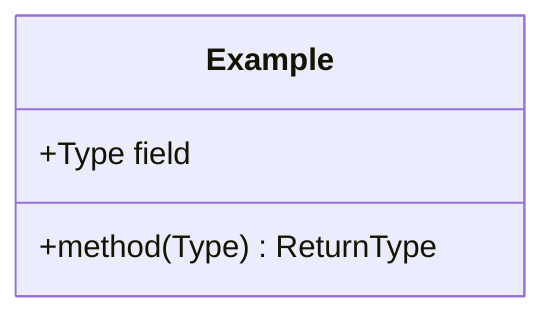
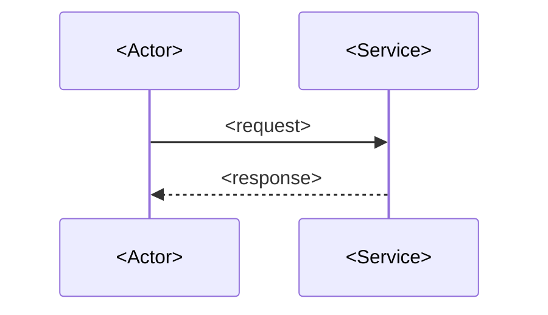
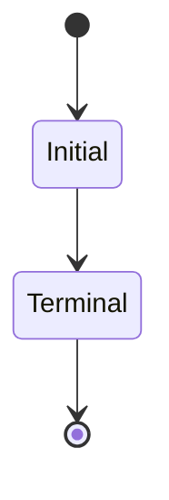

# Design — `<lane / feature name>`

**Status:** `draft | agreed | superseded by <doc>` · **Owner:** `<person (AI)>` ·
**Tasks:** `<T0xx–T0yy>` · **Spec:** [SPEC.md](../../SPEC.md) `<US1, US3>`

> Copy this file to `docs/design/<lane>.md` and fill it in **before** the implementation tasks for
> that lane are written. Rules: [docs/design-documentation.md](../design-documentation.md).
> Delete the sections that carry no ambiguity for this change — but delete them deliberately, not
> because filling them in was work.

---

## 1. What this covers

`<Two or three sentences. The slice of the system this design is responsible for, and where its
boundary is — what it explicitly does NOT cover, and which doc covers that instead.>`

## 2. Reference material

> The single most important section for UI work, and the one most often left empty. Name real
> paths. An assistant that can't find the reference will invent one.

| Kind | Where |
| --- | --- |
| Visual reference / mockup | `<path/to/screen.png, or "none — producing one is T0xx">` |
| Design system / tokens | `<path/to/DESIGN.md or the token file>` |
| Existing code this must match | `<path/to/module>` |
| External standard / schema | `<name + version + link>` |

## 3. Domain model

> Every field here is a field the implementer creates. Fields absent here must not be invented —
> if one is needed, this doc changes first.



`<Notes on anything the diagram can't carry: invariants, units, precision, nullability rules,
which fields are persisted vs. derived.>`

## 4. Flow

> Who calls whom, in what order, and what happens when a step fails.



**Failure paths:** `<what happens on timeout, on rejection, on partial success — the part that
gets skipped and then discovered in production.>`

## 5. State

> Only if something in this design is in one of several states. Transitions not drawn here must be
> made impossible in code, not merely un-implemented.



## 6. Contracts

> The exact interface between this lane and anything else — API shape, event payload, message
> schema, function signature. Verbatim, not described. This is what lets two lanes be built in
> parallel and still compose.

```
<schema / type definitions / endpoint table>
```

## 7. Structure

Files this design creates or changes:

| Path | New? | Responsibility |
| --- | --- | --- |
| `<path>` | new | `<one line>` |

`<For UI, a component tree instead — a mermaid flowchart of which component contains which, so
the implementer builds a decomposition rather than one large file.>`

## 8. Decisions & alternatives

| Decision | Chosen | Rejected, and why |
| --- | --- | --- |
| `<the question>` | `<what we do>` | `<what we didn't, and the actual reason>` |

Deviations from [docs/architecture-defaults.md](../architecture-defaults.md): `<none, or which and
why>`.

## 9. How this is verified

- `<the test that proves the structure is right, not just that something runs>`
- `<for UI: the visual comparison against §2's reference>`

## 10. Open questions

- [ ] `<anything unresolved — an implementer hitting one of these stops and asks, rather than
  picking a plausible answer and burying it in the code>`
