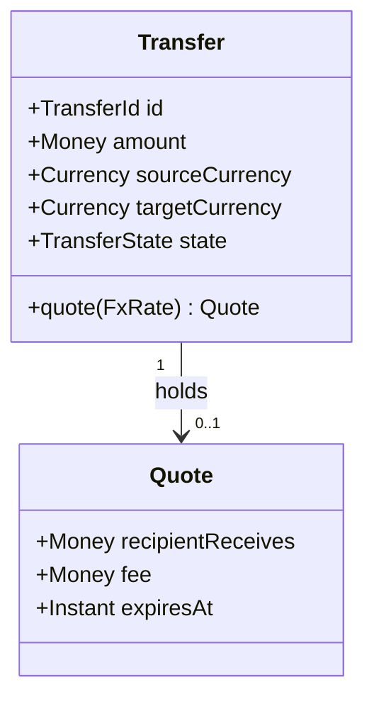
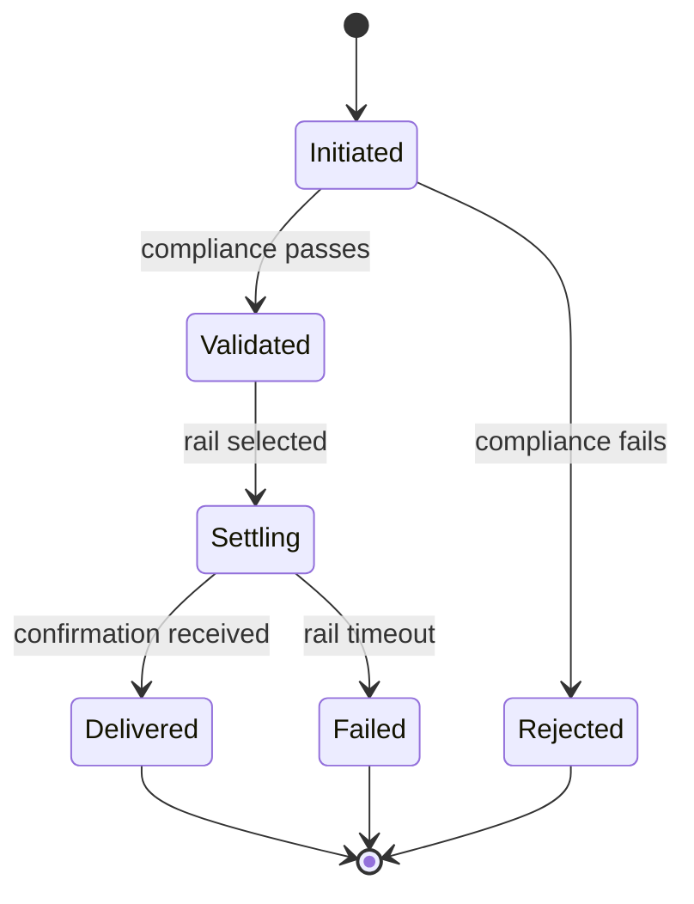

# Design documentation

**No non-trivial code is written until the shapes it produces are drawn.**

This is the rule that exists because of a specific, repeated failure: an AI copilot is handed a
task, understands the *words*, and produces something that satisfies the sentence but not the
system — a UI that renders "a form" instead of *the* form in the mockup, a service with the right
method names and `TODO` bodies, a model class with the right noun and none of the fields anything
downstream actually reads. The words were never the specification. The structure was, and it was
never written down.

Prose is a bad carrier for structure. A class diagram is unambiguous about what fields exist; a
sequence diagram is unambiguous about who calls whom and in what order; a state machine is
unambiguous about which transitions are legal. An assistant given those cannot "interpret" its way
to a plausible-looking wrong answer, because there is a concrete artifact to diff the code against.

> The point is not documentation for its own sake. It's that **a diagram is a target an
> implementation can be checked against, and a paragraph isn't.**

## Where design docs live

```
docs/design/
├── README.md                 <- index: one line per design doc, what it covers
├── domain-model.md           <- the class diagram(s) for the core entities
├── <lane-or-feature>.md      <- one per non-trivial feature/lane
└── ...
```

One design doc per **lane or feature**, named after it, so `feat/<lane>` ↔ `docs/design/<lane>.md`
is obvious. Use [DESIGN-DOC.template.md](../DESIGN-DOC.template.md) as the starting shape.

Diagrams are written as **Mermaid in fenced code blocks**, never as images. Mermaid is text: it
diffs in a PR, it survives a copy-paste into any assistant's context window, and every AI in play
can both read and *write* it. A PNG of a diagram is worse than no diagram, because nobody updates
it and no assistant can parse it.

## Which diagram for which kind of work

Don't draw all five every time. Draw the ones that carry the ambiguity in *this* change.

| If the task... | Draw | Because the failure mode is |
| --- | --- | --- |
| introduces or changes **entities / data** | **class diagram** (`classDiagram`) | invented or missing fields; wrong types; relationships nobody agreed to |
| spans **more than one service, agent, or actor** | **sequence diagram** (`sequenceDiagram`) | the right pieces wired in the wrong order; a call that silently never happens |
| has a thing that is **in one of several states** | **state diagram** (`stateDiagram-v2`) | illegal transitions; a terminal state with no way in, or no way out |
| adds or moves a **service / deployable / queue** | **component diagram** (`flowchart` or `C4Context`) | a service that talks directly to another's datastore; an undeclared dependency |
| builds **user-facing UI** | **component tree** (`flowchart`) + the reference design | "a" screen instead of "the" screen; hand-rolled markup bypassing the component layer |
| is a **contract between two lanes** (API, event, message) | the **schema itself**, verbatim | two sides that each work alone and don't compose |

A one-line bugfix needs none of this. The test is: *could a competent implementer who read only
this task produce something structurally different from what I have in my head?* If yes, draw it.

### UI is a special case

For any user-facing lane, the design doc must point at the **actual visual reference** — the
mockup file, the screenshot, the exported design, the existing screen it must match — and name it
by path. "Build the settings page" is an invitation to invent a settings page. "Build the settings
page in `legacy/mockups/settings/screen.png`, matching its layout, tokens and copy; component tree
below" is a specification.

If there is no visual reference, say so explicitly and treat producing one as the first task —
don't let an assistant silently invent a design and have it become the de-facto reference.

## The rule, operationally

1. **Before implementation tasks are written**, the lane's design doc exists and is merged (a
   `docs/<lane>` PR is fine and fast — it's markdown).
2. **Every implementation task in [TASKS.md](../TASKS.md) cites its design doc** — a task with no
   design reference is either trivial or under-planned, and the reviewer should ask which.
3. **Implementation is checked against the diagram, not against the prose.** In review: does every
   class in the diagram exist with those fields? Does the call order match the sequence? Are all
   the states reachable?
4. **The code and the diagram disagree → one of them is a bug.** Fix whichever is wrong, in the
   same PR. A stale diagram is worse than no diagram, exactly like a stale `project-structure.md`.

## What a design doc is *not*

- **Not a plan.** Phasing, ordering and effort live in [PLAN.md](../PLAN.md) and
  [TASKS.md](../TASKS.md).
- **Not a spec.** User-visible behaviour and acceptance criteria live in [SPEC.md](../SPEC.md).
  The design doc answers *"what shape does the code take"*, sitting between them.
- **Not a record of what was built.** It's written *before*, and corrected when reality forces it.
  The retrospective version of this is [project-structure.md](project-structure.md).

## Worked example (shape only)

````markdown
## Domain model



## Settlement lifecycle


````

Every field in that class diagram is a field the implementer must create, and every transition in
that state machine is one the implementer must make legal — and, just as importantly, every
transition *not* drawn is one they must make impossible.

## Where this shows up

- [DESIGN-DOC.template.md](../DESIGN-DOC.template.md) — the per-feature template.
- [planning-workflow.md](planning-workflow.md) — step 3 of the loop is "Draw the shapes", between
  the HOW and the task breakdown.
- [TASKS.template.md](../TASKS.template.md) — every task carries a `Design:` reference.
- [../AGENTS.md](../AGENTS.md) §8 — "matches its design doc" is part of the Definition of Done.
- Every entry-point file (`CLAUDE.md` / `GEMINI.md` / …) sends assistants here before they build.
