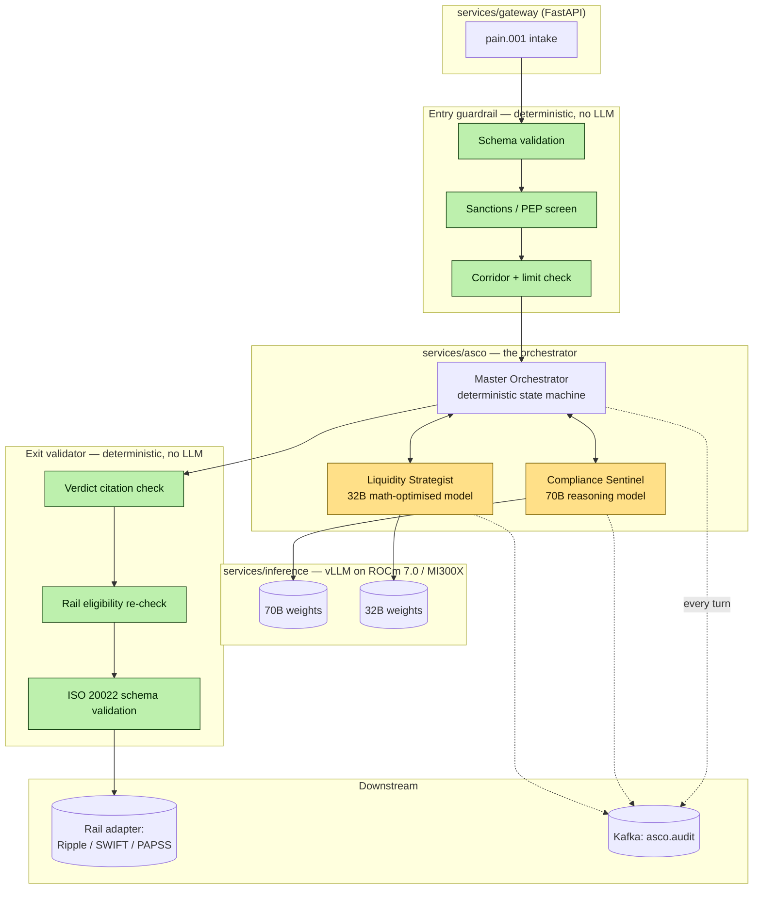
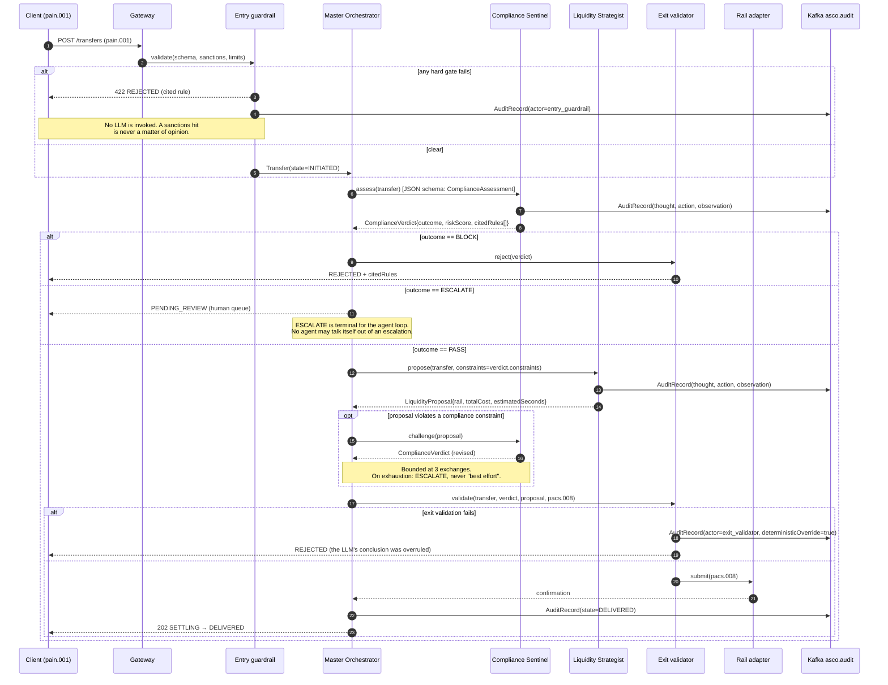

# Design — `asco` (Agentic Settlement & Compliance Orchestrator)

**Status:** agreed · **Owner:** Kirito (Claude) · **Tasks:** T040–T052 ·
**Spec:** [SPEC.md](../../SPEC.md) US2, US3

> The engine. Three agents negotiate a transfer; deterministic guardrails decide whether their
> conclusion is allowed to leave the building.

---

## 1. What this covers

The negotiation between the Compliance Sentinel, the Liquidity Strategist and the Master
Orchestrator; the hard-coded gates on either side of them; and the audit trail they emit. It does
**not** cover the entity definitions ([domain-model.md](domain-model.md)) or the wire format
([iso20022-messaging.md](iso20022-messaging.md)).

## 2. Reference material

| Kind | Where |
| --- | --- |
| Agent personas + model sizing | `docs/reference/UbuntuRemit_ ASCO Project Overview.pdf` §2 |
| Guardrail pattern, risk register | `docs/reference/UbuntuRemit_ ASCO Implementation Approach.pdf` §3–4 |
| Hardware envelope | `docs/reference/UbuntuRemit_ ASCO Research and Feasibility Paper.pdf` §4 |
| External standard | ISO 20022 pain.001 / pacs.008 |

## 3. Components



**The colouring is the point.** Green nodes are deterministic and are the only things authorised
to permit or forbid a settlement. Gold nodes are LLMs: they *suggest*, they *rank*, they *explain*
— they never decide. This is the Hybrid Guardrail Pattern from the Implementation Approach, and
it is the mitigation for the top-line risk in that document's register (non-deterministic output →
regulatory fines).

## 4. Negotiation flow



### Failure paths, explicitly

| Failure | Behaviour |
| --- | --- |
| Inference timeout (either agent) | `ESCALATE` to the human queue. **Never** default-allow. |
| Agent returns malformed JSON | One re-ask with the schema; second failure → `ESCALATE`. |
| Negotiation exceeds 3 exchanges | `ESCALATE`. No "best effort" settlement. |
| Rail rejects `pacs.008` | `FAILED`, then at most 2 alternate rails (domain-model §4). |
| Kafka unavailable | **Refuse the transfer.** An unauditable settlement is worse than a failed one — SARB PEM requires every node identifiable. |

That last row is a deliberate availability trade-off and is recorded again in §7.

## 5. Contracts — the agent handshake

Agents exchange **JSON validated against a schema**, never prose. This is the Implementation
Approach's "JSON-schema-based communication protocol to ensure agents exchange findings
deterministically without hallucinating payload structures". Both models are served with
constrained decoding against these schemas; a response that doesn't validate is not parsed
leniently, it is re-asked once and then escalated.

```jsonc
// Master Orchestrator -> Compliance Sentinel
{
  "transferId": "string (uuid)",
  "corridor": { "source": "ZAR", "target": "KES" },
  "amount": { "minorUnits": 1500000, "currency": "ZAR" },
  "declaration": { "purpose": "FAMILY_SUPPORT", "sourceOfFunds": "EMPLOYMENT_SALARY" },
  "senderProfile": { "kycTier": "L3", "countryOfResidence": "ZA", "isPep": false },
  "recipientProfile": { "countryOfResidence": "KE", "accountAgeDays": 412 },
  "priorTransfers30d": { "count": 4, "totalMinorUnits": 4200000 }
}
```

```jsonc
// Compliance Sentinel -> Master Orchestrator   (schema: ComplianceVerdict)
{
  "outcome": "PASS | ESCALATE | BLOCK",     // required
  "riskScore": 0.0,                          // required, 0.0-1.0
  "citedRules": ["FICA s21", "SARB EXCON B.4"], // required, MIN LENGTH 1
  "rationale": "string, <= 600 chars",       // required
  "constraints": {                            // optional; binds the Liquidity Strategist
    "forbiddenRails": ["SWIFT"],
    "maxSettlementSeconds": 5
  }
}
```

```jsonc
// Master Orchestrator -> Liquidity Strategist
{
  "transferId": "string (uuid)",
  "corridor": { "source": "ZAR", "target": "KES" },
  "amount": { "minorUnits": 1500000, "currency": "ZAR" },
  "constraints": { "forbiddenRails": ["SWIFT"], "maxSettlementSeconds": 5 },
  "railQuotes": [
    { "rail": "RIPPLE", "feeMinorUnits": 0, "spreadBps": 12, "estimatedSeconds": 3.2 },
    { "rail": "PAPSS",  "feeMinorUnits": 1200, "spreadBps": 8, "estimatedSeconds": 11.0 }
  ]
}
```

```jsonc
// Liquidity Strategist -> Master Orchestrator   (schema: LiquidityProposal)
{
  "rail": "RIPPLE | SWIFT | PAPSS",          // required, MUST be one of the supplied railQuotes
  "totalCost": { "minorUnits": 1800, "currency": "ZAR" },  // required
  "estimatedSeconds": 3.2,                    // required
  "rationale": "string, <= 400 chars"         // required
}
```

**`railQuotes` are supplied to the model, never invented by it.** The Strategist ranks options it
was given; a rail or a fee that wasn't in the input is a fabrication, and the exit validator
rejects the proposal outright (Non-negotiable I).

## 6. Structure

| Path | New? | Responsibility |
| --- | --- | --- |
| `services/gateway/` | planned | FastAPI intake, pain.001 parsing, auth |
| `services/asco/orchestrator/` | planned | The state machine in §4 — **deterministic, no LLM calls of its own** |
| `services/asco/agents/sentinel.py` | planned | Compliance Sentinel prompt + schema binding |
| `services/asco/agents/strategist.py` | planned | Liquidity Strategist prompt + schema binding |
| `services/asco/guardrails/entry.py` | planned | Schema, sanctions, limits |
| `services/asco/guardrails/exit.py` | planned | Citation check, rail re-check, ISO 20022 validation |
| `services/inference/` | planned | vLLM serving both models on one MI300X node |
| `services/audit/` | planned | Kafka `asco.audit` consumer → append-only store |

## 7. Decisions & alternatives

| Decision | Chosen | Rejected, and why |
| --- | --- | --- |
| Orchestrator implementation | deterministic Python state machine | an LLM orchestrator — a non-deterministic controller makes the whole audit trail unreproducible |
| Agent framework | explicit schema-bound calls | AutoGen/LangGraph free-form chat — free-form turns are what produce unparseable payloads under load |
| Negotiation bound | 3 exchanges, then ESCALATE | unbounded — RTGS SLA windows are hard deadlines |
| Model placement | both models co-resident on one MI300X (192GB HBM3) | two nodes — the Feasibility Paper sizes 70B + 32B onto a single node; two nodes doubles cost for no latency win |
| Quantisation | FP8, measured before adoption | assuming FP4 is fine — the risk register allows FP8/FP4 for latency, but reasoning degradation must be measured, not assumed |
| Audit unavailable | refuse the transfer | settle-and-log-later — an unauditable settlement violates SARB PEM traceability |

Deviations from [../architecture-defaults.md](../architecture-defaults.md): none.

## 8. How this is verified

- **Determinism harness:** the same transfer replayed 50× against a pinned model + seed produces
  the same `outcome` and the same `rail`. Variance here is a release blocker.
- **Guardrail bypass test:** a crafted Sentinel response of `{"outcome":"PASS","citedRules":[]}`
  must be rejected by the exit validator, not passed through.
- **Fabricated-rail test:** a Strategist proposal naming a rail absent from `railQuotes` is
  rejected and audited with `deterministicOverride=true`.
- **Escalation test:** inference timeout produces `ESCALATE`, never `PASS`.
- **Audit completeness:** every terminal state has ≥ 1 `AuditRecord` per participating actor.

## 9. Open questions

- [ ] Which sanctions list provider, and what is its refresh SLA? The entry guardrail's
      correctness is bounded by this and it cannot be stubbed.
- [ ] Human-review queue: who staffs `ESCALATE`, and what is the SLA before a transfer expires?
- [ ] Are `railQuotes` pulled synchronously per transfer, or from a cached book? Affects whether
      `FxQuote.source` can ever be `FALLBACK_CACHED` on a live settlement.
