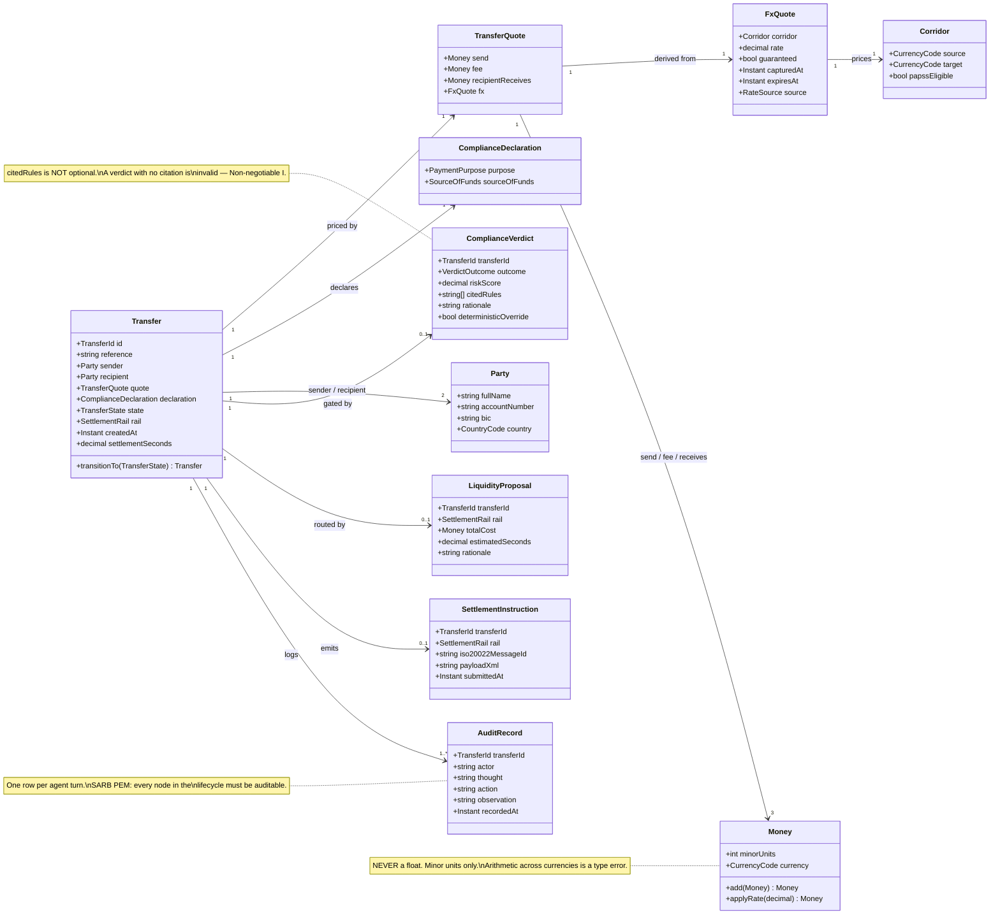
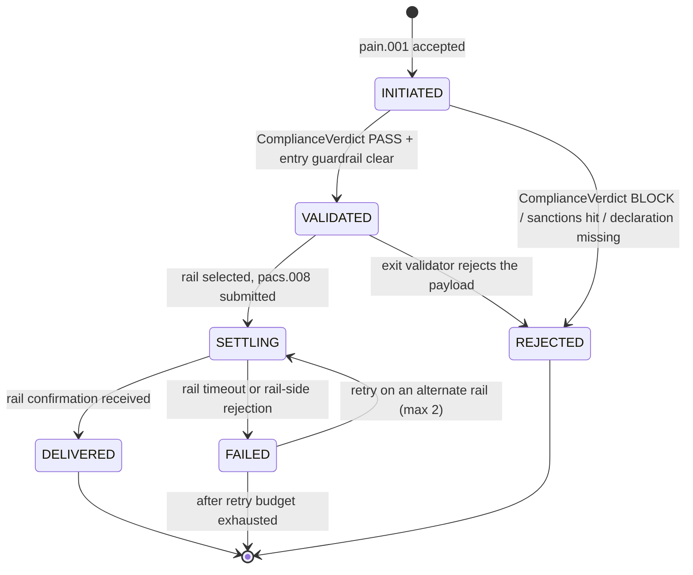

# Design — `domain` (the core model)

**Status:** agreed · **Owner:** Kirito (Claude) · **Tasks:** T003, T030–T034 ·
**Spec:** [SPEC.md](../../SPEC.md) US1–US4

> The nouns of UbuntuRemit. Every service and the web client build to the classes below.
> Rules: [../design-documentation.md](../design-documentation.md).

---

## 1. What this covers

The entities shared across every bounded context: money, corridors, transfers, quotes, compliance
declarations and verdicts, and the settlement lifecycle. It does **not** cover how a rail is
chosen or how agents negotiate ([asco-orchestrator.md](asco-orchestrator.md)), nor the wire format
sent to a rail ([iso20022-messaging.md](iso20022-messaging.md)).

## 2. Reference material

| Kind | Where |
| --- | --- |
| Product source | `docs/reference/UbuntuRemit_ ASCO Project Overview.pdf` |
| Regulatory constraints | `docs/reference/UbuntuRemit_ ASCO Research and Feasibility Paper.pdf` §2–3 |
| Existing implementation | none yet — these entities are unimplemented in any language |
| External standard | ISO 20022 (pain.001.001.09 / pacs.008.001.08 / camt.053.001.08), ISO 4217 |

## 3. Domain model



### Invariants the diagram can't carry

- **Money is integral minor units.** No monetary value is ever a float, at any layer, including
  JSON on the wire. Cross-currency arithmetic without an `FxQuote` is a type error.
- **`Transfer.quote` is immutable once `state != INITIATED`.** A re-quote produces a new
  `TransferQuote`; the old one stays on the audit trail.
- **`ComplianceVerdict.citedRules` is non-empty for every outcome, including `PASS`.** An
  uncited verdict is the exact fabrication Non-negotiable I forbids.
- **`deterministicOverride = true`** means the rule-based exit validator overrode the LLM's
  suggestion. This field exists so an auditor can count how often the guardrails fired.
- **`AuditRecord` is append-only.** No update path, no delete path, ever.

## 4. Settlement lifecycle



**Transitions not drawn here must be impossible in code, not merely unimplemented.** In
particular: there is no path from `REJECTED` to anything, no path that skips `VALIDATED`, and no
path from `DELIVERED` back to `SETTLING`. A rejected transfer that needs to proceed is a *new*
transfer with a new id, so the audit trail of the rejection survives intact.

`FAILED → SETTLING` is the only cycle, and it is bounded at 2 retries — this is the "resolves
friction through negotiation rather than rejecting outright" behaviour from the Project Overview,
made finite so it can't loop against an RTGS SLA window.

## 5. Contracts

There is no implementation of these types yet, in any language. When one lands (`services/ledger`
first — see §6), it is built to this diagram: a **narrower** projection is allowed where a context
genuinely doesn't need a field; **adding a field the diagram doesn't have is not**, and the fix for
a missing field is to change this document first.

```
CurrencyCode  = ZAR | KES | NGN | GHS | USD          (ISO 4217, extend deliberately)
SettlementRail = RIPPLE | SWIFT | PAPSS
TransferState  = INITIATED | VALIDATED | SETTLING | DELIVERED | REJECTED | FAILED
VerdictOutcome = PASS | ESCALATE | BLOCK
PaymentPurpose = FAMILY_SUPPORT | BUSINESS_INVESTMENT | GOODS_OR_SERVICES | EDUCATION | MEDICAL
SourceOfFunds  = EMPLOYMENT_SALARY | BUSINESS_REVENUE | SAVINGS
RateSource     = LIVE_INTERBANK | PAPSS_QUOTED | FALLBACK_CACHED
```

`PaymentPurpose` and `SourceOfFunds` are closed enums because SARB reporting requires a fixed
taxonomy — a free-text purpose is not reportable, and "Other" is deliberately absent.

## 6. Structure

| Path | New? | Responsibility |
| --- | --- | --- |
| `services/ledger/domain/` | planned | Canonical Python implementation of these entities |
| `services/compliance/domain/verdict.py` | planned | `ComplianceVerdict` + the deterministic validators |
| `services/liquidity/domain/proposal.py` | planned | `LiquidityProposal`, rail cost model |
| `apps/web/*.html` | exists | Static pages; carry no domain logic and no arithmetic |

## 7. Decisions & alternatives

| Decision | Chosen | Rejected, and why |
| --- | --- | --- |
| Monetary representation | integral minor units | `Decimal`/float — float is disqualifying in settlement; `Decimal` is fine server-side but doesn't survive JSON, so minor units are the wire format either way |
| Verdict shape | outcome + risk score + **cited rules** | outcome alone — an uncitable verdict can't be defended to an auditor, which is the whole product claim |
| Retry on failure | bounded, max 2 alternate rails | unbounded retry — it can silently blow an RTGS SLA window |
| Rejected → retry | new `Transfer` id | reopening the rejected one — destroys the audit record of the rejection |

Deviations from [../architecture-defaults.md](../architecture-defaults.md): none. One service per
bounded context; Kafka chosen over RabbitMQ specifically because the audit log needs retention and
replay (defaults §2).

## 8. How this is verified

- Property test: no arithmetic path can produce a non-integer `minorUnits`.
- State-machine test: every transition **not** in §4 raises, enumerated exhaustively over
  `TransferState × TransferState` — this is the test that makes "undrawn = impossible" real.
- Contract test: every language binding of these entities is a subset of §3 (no extra fields).
- `ComplianceVerdict` with an empty `citedRules` fails construction.

## 9. Open questions

- [ ] Does SARB reporting need the sender's `bic` on retail (non-institutional) transfers, or only
      corporate? Affects whether `Party.bic` is nullable.
- [ ] `FxQuote.expiresAt` — what is the guaranteed-rate hold window? The mockup says "Guaranteed"
      but names no duration, and guessing one is a fabricated commercial term.
