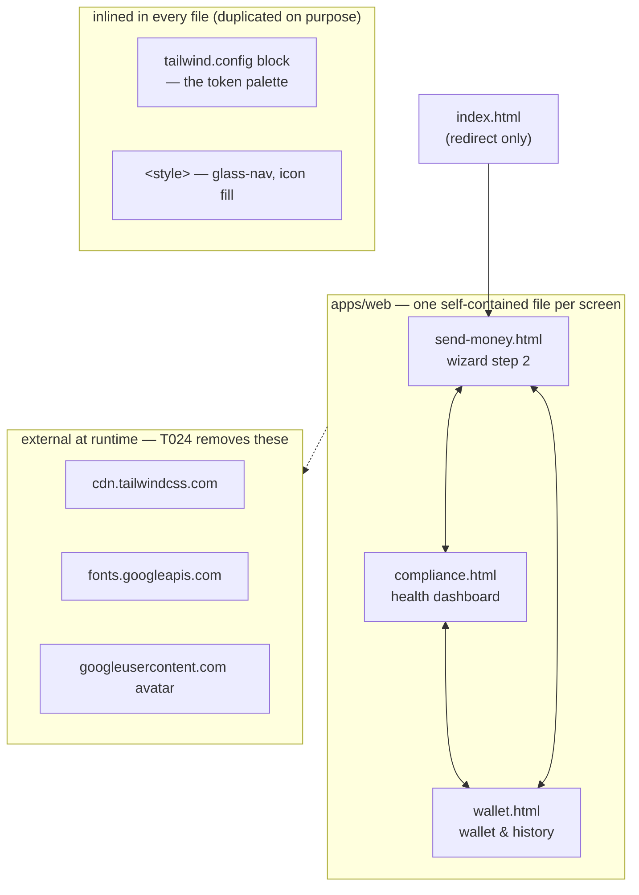
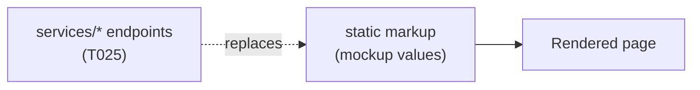

# Design — `frontend-web` (apps/web)

**Status:** agreed · **Owner:** Kirito (Claude) · **Tasks:** T010–T025 ·
**Spec:** [SPEC.md](../../SPEC.md) US1, US5

> ⚠ **Frontend lanes are Claude's by default** ([AGENTS.md](../../AGENTS.md) §1). Other assistants
> may wire the pages to endpoints; they do not restructure, restyle, or port them to a framework.

---

## 1. What this covers

The client: three static HTML pages, exported from Stitch, served as-is. It does not cover the API
they will eventually call ([asco-orchestrator.md](asco-orchestrator.md) §5 has the contracts).

> **2026-07-27 — the React rewrite was reverted.** A React 19 / Vite / Tailwind v4 port of these
> three screens was built and rejected on sight: it did not look like the mockups. It has been
> deleted. What survives is the lesson, recorded in §8: *a faithful port is a visual-fidelity task,
> and it cannot be signed off by a session that can't see the result.* Do not re-attempt a
> framework port without (a) agreement here first and (b) working screenshot tooling.

## 2. Reference material

**The screenshots are the specification. Open them before changing anything.**

| Kind | Where |
| --- | --- |
| Send-money wizard (step 2) | `legacy/stitch-mockups/send_money_wizard/screen.png` |
| Compliance dashboard | `legacy/stitch-mockups/compliance_dashboard/screen.png` |
| Wallet & history | `legacy/stitch-mockups/wallet_history/screen.png` |
| The shipping pages | `apps/web/send-money.html`, `compliance.html`, `wallet.html` |
| Design system rationale | `legacy/stitch-mockups/ubuntu_heritage/DESIGN.md` |

`DESIGN.md` is still binding: the no-line rule, tonal elevation, glass & gold, and the Do/Don't
list govern any new UI.

## 3. Structure

**The duplication is deliberate.** Three self-contained files with no shared partials, no build
step, and no framework. Factoring out the common chrome is a *design decision* that changes this
document first — it is not a passing cleanup, and it is exactly the kind of "improvement" that
produced a UI nobody wanted.

## 4. Data flow

Today the figures are the mockup's static values. That is honest — nothing on these pages claims
to be a live rate, balance, or verdict, and until T025 nothing should. When the endpoints land,
values are populated from the shapes in [domain-model.md](domain-model.md) §3.

## 5. Token mapping

Tokens live in each file's `tailwind.config` block and are the ground truth.

| Design system term | Token | Used for |
| --- | --- | --- |
| The earth | `primary` `#164212` | Primary actions, active nav, headings |
| Gradient CTA | `primary → primary-container` | Primary buttons (never a flat fill) |
| Prosperity | `secondary` `#735c00` | ISO 20022 marks, "Recipient Gets", trust badges |
| The tonal stack | `surface-container-{lowest…highest}` | Card boundaries — background shifts, not borders |
| Ghost border | `outline-variant` @ 15% | Only where contrast genuinely fails |
| Display type | Manrope | Headings and large numerics |
| Engine type | Inter | Transactional data and labels |

## 6. Contracts

When T025 wires these pages up, they consume the shapes in [domain-model.md](domain-model.md) §3.
The endpoints are listed in [asco-orchestrator.md](asco-orchestrator.md) §5 and PLAN.md.

## 7. Files

| Path | Responsibility |
| --- | --- |
| `apps/web/index.html` | Redirect to `send-money.html`. No UI. |
| `apps/web/send-money.html` | Wizard step 2 — self-contained |
| `apps/web/compliance.html` | Compliance dashboard — self-contained |
| `apps/web/wallet.html` | Wallet & history — self-contained |
| `apps/web/README.md` | How to serve it, what was changed, the rules |
| `legacy/stitch-mockups/` | Frozen reference — the PNGs and the original export |

## 8. Decisions & alternatives

| Decision | Chosen | Rejected, and why |
| --- | --- | --- |
| **Framework** | **none — ship the exported HTML** | React/Vite/Tailwind v4 port. It was built, and rejected on sight for not looking like the mockups. The export already *is* the approved design; re-expressing it in components put the one thing that mattered — fidelity — at risk for benefits (state, reuse) nothing needs yet |
| Shared chrome | duplicated per file | partials/templating — introduces a build step for three pages, and every extraction is a chance to drift from the reference |
| Nav links | 9 `href`s wired between existing pages | leaving them all `#` — three disconnected files aren't an app |
| Dashboard / Settings / Support links | left dead | pointing them somewhere — there is no design for those screens, and inventing one is the failure AGENTS.md §2a names |
| External CDNs | flagged as **T024**, not silently fixed | swapping them out during the revert — that's an unrelated change riding along on a revert, and it touches every file |

### The lesson from the reverted rewrite

Recorded here because the process is supposed to absorb this kind of failure rather than repeat it
([planning-workflow.md](../planning-workflow.md) § Planning for a specific assistant):

- **A port is a fidelity task, not a translation task.** The acceptance criterion is "indistinguishable
  from the PNG", and no amount of correct structure substitutes for that.
- **A visual task cannot be signed off by a session that cannot see the output.** The session that
  built the React app had no screenshot tooling and said so — but it still reported the work as
  done, deferring the visual check. That ordering was wrong: with no way to verify the *only*
  criterion that mattered, the task was blocked, not complete.
- **A rewrite of already-approved output needs its cost paid up front.** The export was the
  approved design. Re-expressing it bought reusable components nothing yet consumes and risked the
  one property that was already correct.

## 9. How this is verified

- **Serve and look:** `python3 -m http.server 5173 --directory apps/web`, then open each page
  beside its PNG in `legacy/stitch-mockups/`. This is the whole test, and it is manual.
- Every `href` resolves to a file that exists, or is deliberately `#` per §8.
- No `<script>` other than the Tailwind CDN tag (until T024 removes it).

## 10. Open questions

- [ ] **Wizard steps 1 (Amount), 3 (Compliance) and 4 (Review) have no visual reference** — only
      step 2 was exported. The ribbon shows the real four-step flow. Designing them is **T021**;
      an assistant asked to "build step 3" before that exists should stop and say so.
- [ ] **`/dashboard` has no visual reference** either — the nav lists it, no screen was exported.
      Its link is dead rather than pointing at an invented page. **T022**.
- [ ] `Settings` and `Support` — same treatment.
- [ ] Dark mode: `DESIGN.md` specifies only the light tonal stack, so there is no dark ramp to
      build to. Not attempted.
- [ ] **The export's copy overclaims against the conformance boundary.** `compliance.html` says the
      engine is "fully integrated with FATF Travel Rule protocols and ISO 20022 messaging
      standards"; `wallet.html` says transfers are "backed by Tier 1 banking protocols". Neither is
      demonstrable, and iso20022-messaging.md §3.6 says we build on the base catalogue and claim no
      more. But this is frozen mockup copy, and §8 says the export isn't edited casually — so two
      project rules genuinely conflict here and **neither wins by default**. It needs a decision
      recorded in §8 (rewrite the copy and accept the deviation from the reference / keep it and
      gate on T025 / caveat it elsewhere). Raised by T032. It is not urgent while the pages are
      static and nothing on them purports to be a real transaction; it becomes urgent the moment
      T025 puts live data behind that copy.
- [ ] Accessibility has not been assessed on the export — no focus-visible styling, decorative
      icons unlabelled, the settlement chart is colour-only with no table view. Auditing it is
      **T026**, and any fix must be checked against the PNGs like anything else.
