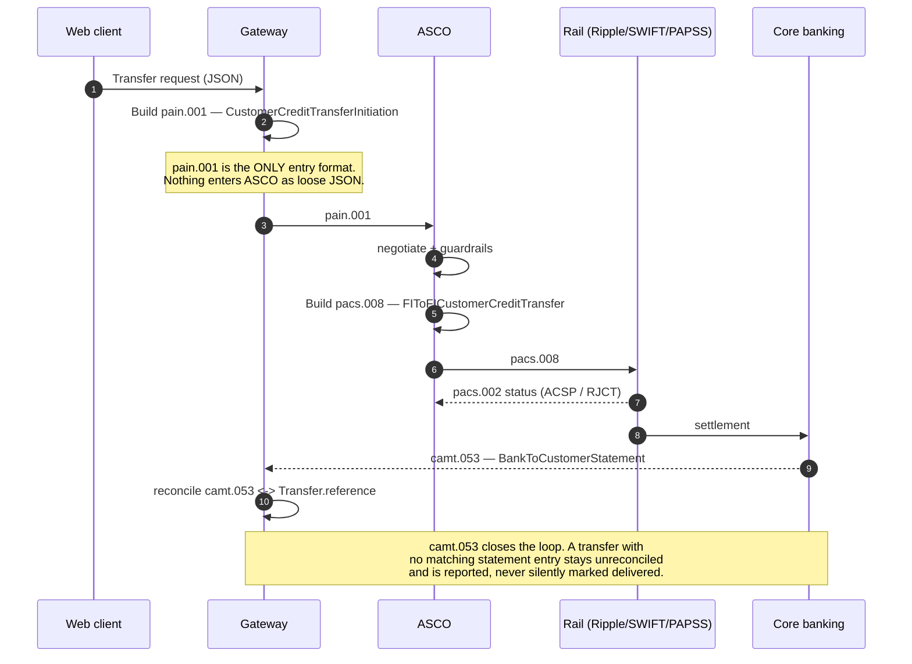
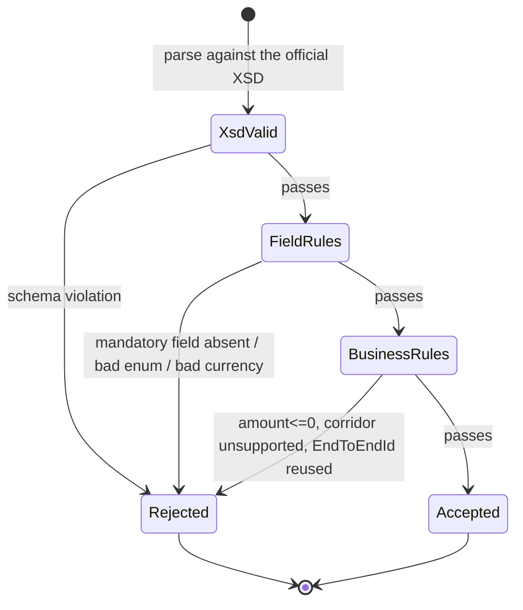

# Design — `iso20022` (messaging & the audit trail)

**Status:** agreed · **Owner:** Kirito (Claude) · **Tasks:** T060–T068 ·
**Spec:** [SPEC.md](../../SPEC.md) US3, US4

> What leaves the building, in exactly what shape. The Implementation Approach names finalising
> the pain.001 schema as the immediate priority; this is that schema.

---

## 1. What this covers

The three message types UbuntuRemit handles, the field-level mapping between the domain model and
each of them, and the validation gates. It does **not** cover rail-specific transport
(`services/rails/*`) or the negotiation that decides the rail
([asco-orchestrator.md](asco-orchestrator.md)).

## 2. Reference material

| Kind | Where |
| --- | --- |
| Message-type table | `docs/reference/UbuntuRemit_ ASCO Research and Feasibility Paper.pdf` §3 |
| Domain entities | [domain-model.md](domain-model.md) §3 |
| External standard | ISO 20022 — `pain.001.001.09`, `pacs.008.001.08`, `camt.053.001.08` |

> ⚠ **Versions are provisional.** The Feasibility Paper names the message *types* but not their
> version suffixes. The `.001.09` / `.001.08` numbers above are the versions this design targets
> and **must be confirmed against the SARB PEM implementation guide before the first live
> submission** — pinning a version from memory is precisely the fabrication Non-negotiable I
> forbids. Tracked as an open question in §9.

## 3. Message lifecycle

## 4. Field mapping

**pain.001 — Customer Credit Transfer Initiation** (client → ASCO)

| ISO 20022 path | Domain source | Notes |
| --- | --- | --- |
| `GrpHdr/MsgId` | generated ULID | Unique per submission, never reused |
| `GrpHdr/CreDtTm` | `Transfer.createdAt` | ISO 8601, UTC, always |
| `GrpHdr/NbOfTxs` | `1` | UbuntuRemit submits one transaction per message |
| `PmtInf/PmtInfId` | `Transfer.reference` | The `UB-99420-X` shown in the UI |
| `PmtInf/Dbtr/Nm` | `Transfer.sender.fullName` | |
| `PmtInf/DbtrAcct/Id/IBAN` | `Transfer.sender.accountNumber` | `Othr/Id` where the corridor has no IBAN |
| `PmtInf/DbtrAgt/FinInstnId/BICFI` | `Transfer.sender.bic` | |
| `CdtTrfTxInf/Amt/InstdAmt` | `Transfer.quote.send` | `@Ccy` from `Money.currency`; **decimal string from minor units, never a float literal** |
| `CdtTrfTxInf/Cdtr/Nm` | `Transfer.recipient.fullName` | |
| `CdtTrfTxInf/CdtrAcct/Id` | `Transfer.recipient.accountNumber` | |
| `CdtTrfTxInf/Purp/Cd` | `ComplianceDeclaration.purpose` | Mapped to ISO `ExternalPurpose1Code` — see the table below |
| `CdtTrfTxInf/RmtInf/Ustrd` | free text | **Never** used to carry structured data |

`PaymentPurpose` → `ExternalPurpose1Code`:

| Domain | ISO code | Meaning |
| --- | --- | --- |
| `FAMILY_SUPPORT` | `FAMI` | Family maintenance |
| `BUSINESS_INVESTMENT` | `BEXP` | Business expenses |
| `GOODS_OR_SERVICES` | `GDDS` | Purchase/sale of goods |
| `EDUCATION` | `EDUC` | Education |
| `MEDICAL` | `HLTI` | Health insurance / medical |

`SourceOfFunds` has **no ISO purpose code** — it is a SARB EXCON declaration, carried in
`SplmtryData`, not squeezed into `Purp`. Mapping it into `Purp` would misreport the payment.

**pacs.008 — FI to FI Customer Credit Transfer** (ASCO → rail)

| ISO 20022 path | Domain source | Notes |
| --- | --- | --- |
| `GrpHdr/MsgId` | generated ULID | Distinct from the pain.001 `MsgId` |
| `GrpHdr/SttlmInf/SttlmMtd` | derived from `SettlementInstruction.rail` | `CLRG` for PAPSS, `INDA`/`INGA` per rail agreement |
| `CdtTrfTxInf/PmtId/EndToEndId` | `Transfer.reference` | **The join key across all three messages** |
| `CdtTrfTxInf/PmtId/TxId` | `Transfer.id` | |
| `CdtTrfTxInf/IntrBkSttlmAmt` | `Transfer.quote.recipientReceives` | Target currency |
| `CdtTrfTxInf/ChrgBr` | `SLEV` | Zero-fee retail corridors per the product |
| `SplmtryData/Envlp` | `ComplianceVerdict.citedRules` + `riskScore` | Carries the audit hook downstream |

**camt.053 — Bank to Customer Statement** (core banking → reconciliation)

| ISO 20022 path | Reconciled against | Notes |
| --- | --- | --- |
| `Ntry/NtryRef` / `Ntry/NtryDtls/TxDtls/Refs/EndToEndId` | `Transfer.reference` | Exact match required |
| `Ntry/Amt` | `Transfer.quote.recipientReceives` | Mismatch → unreconciled, alert, never auto-adjust |
| `Ntry/Sts` | drives `DELIVERED` | `BOOK` only; `PDNG` leaves the transfer `SETTLING` |

## 5. Validation gates

Three gates, in this order, all deterministic. **No LLM participates in message validation** — a
model is never asked whether an XML document conforms to a schema, because a validator answers
that question exactly and a model answers it approximately.

`EndToEndId` reuse is a hard rejection rather than a warning: a duplicate join key silently breaks
reconciliation for both transfers.

## 6. Structure

| Path | New? | Responsibility |
| --- | --- | --- |
| `services/messaging/schemas/` | planned | The official XSDs, vendored and version-pinned |
| `services/messaging/pain001.py` | planned | Build + parse, with the §4 mapping as data |
| `services/messaging/pacs008.py` | planned | Build + parse |
| `services/messaging/camt053.py` | planned | Parse + reconcile |
| `services/messaging/validate.py` | planned | The three gates in §5 |

## 7. Decisions & alternatives

| Decision | Chosen | Rejected, and why |
| --- | --- | --- |
| Entry format | pain.001 for everything | loose JSON at the gateway — a second entry format means a second validation surface, and it always drifts |
| Amount encoding | decimal string derived from minor units | float — a float in an ISO 20022 amount is a rounding incident waiting for an auditor |
| `SourceOfFunds` | `SplmtryData` | folding into `Purp/Cd` — would actively misreport the payment purpose to SARB |
| XSD source | vendored + pinned | fetched at runtime — a schema that can change under you is not a gate |
| Reconciliation mismatch | flag, alert, never auto-adjust | auto-correcting to the statement — that's fabricating a settlement outcome |

## 8. How this is verified

- Round-trip test: `Transfer` → pain.001 → parse → `Transfer` is lossless for every mapped field.
- XSD conformance for a golden message of each type, against the vendored schema.
- Negative tests, one per §5 rejection reason, each asserting the *specific* rejection.
- Reconciliation test: a camt.053 whose `Amt` differs by one minor unit leaves the transfer
  unreconciled and raises — it does not mark it `DELIVERED`.

## 9. Open questions

- [ ] **Confirm the exact ISO 20022 version suffixes** against the SARB PEM implementation guide
      (§2 warning). Blocks the first live submission; do not guess.
- [ ] Does PAPSS require its own `SttlmMtd`/envelope conventions beyond standard pacs.008?
- [ ] Is camt.053 delivered intraday or end-of-day? Determines how long a delivered-but-unreconciled
      transfer legitimately sits in that state before it's an alert.
