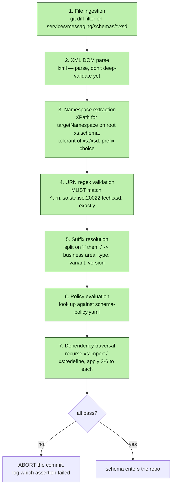
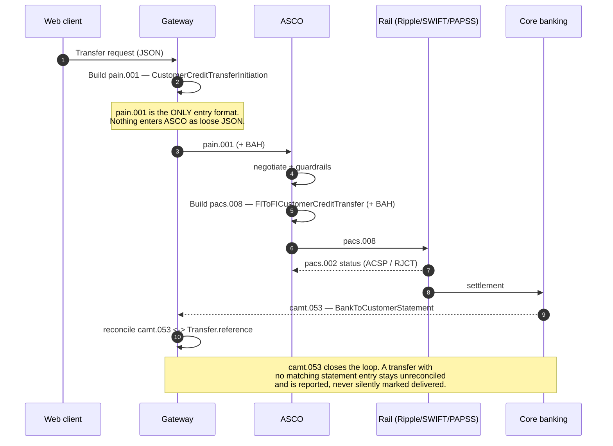

# Design — `iso20022` (messaging, schema governance & the audit trail)

**Status:** agreed · **Owner:** Kirito (Claude) · **Tasks:** T060–T068 ·
**Spec:** [SPEC.md](../../SPEC.md) US3, US4

> What leaves the building, in exactly what shape — and how we prove the shape is the one SARB
> will accept, rather than the one we assumed.

---

## 1. What this covers

The three message types UbuntuRemit handles, the field-level mapping between the domain model and
each of them, the schema-governance pipeline that decides which schema version is legal, and the
validation gates. It does **not** cover rail-specific transport (`services/rails/*`) or the
negotiation that decides the rail ([asco-orchestrator.md](asco-orchestrator.md)).

## 2. Reference material

| Kind | Where |
| --- | --- |
| Message-type table | `docs/reference/UbuntuRemit_ ASCO Research and Feasibility Paper.pdf` §3 |
| **Schema versioning & verification under SARB PEM** | `docs/reference/SARB ISO 20022 Suffix Verification.pdf` |
| Domain entities | [domain-model.md](domain-model.md) §3 |
| External standard | ISO 20022 — URN anatomy in §3 below |
| **The authority on versions** | **SWIFT MyStandards, SARB/PASA readiness portal — we do not have access yet (§10)** |

## 3. Schema authority and version governance

> This section supersedes the earlier "the versions are provisional, confirm them" note. The
> verification paper reframed the problem: **there is no static answer to look up.**

### 3.1 What the URN actually encodes

Every valid ISO 20022 XSD declares a `targetNamespace` on its root `<xs:schema>`:

```xml
<xs:schema xmlns="urn:iso:std:iso:20022:tech:xsd:pacs.008.001.09"
           xmlns:xs="http://www.w3.org/2001/XMLSchema"
           elementFormDefault="qualified"
           targetNamespace="urn:iso:std:iso:20022:tech:xsd:pacs.008.001.09">
```

The identifier is four period-delimited components:

| Component | Example | Meaning |
| --- | --- | --- |
| **Business area** | `pacs` | Domain — `pacs` (clearing & settlement), `camt` (cash management), `pain` (payments initiation), `auth` (authorities/reporting) |
| **Message type** | `008` | The transaction type — `008` is FIToFI Customer Credit Transfer, `009` is FI Credit Transfer |
| **Variant** | `001` | Almost always `001` (the global standard); clearing houses may theoretically register variants but the practice is to constrain via Usage Guidelines instead |
| **Version suffix** | `09` | The chronological release. **This is the component that breaks production.** |

A `.08` → `.09` change is not cosmetic: elements are added or removed (UETR, LEI arrays),
multiplicities tighten (`[0..1]` → `[1..1]`, `maxOccurs="unbounded"` → capped), and data types widen
(`Max35Text` → `Max140Text`, which changes downstream column widths). A payload declaring `.09`
against a gateway configured for `.08` is **rejected at the network perimeter** — the namespace is
simply unrecognised.

### 3.2 SARB does not let you pick

SARB does not permit institutions to select generic ISO 20022 versions. Jurisdiction-specific
**Usage Guidelines** are published through **SWIFT MyStandards**, where a Portal Publisher (PASA or
SARB) manages the lifecycle and member institutions consume the published guidelines. Those
guidelines are exportable as authoritative **XML Schemas** — not just PDFs.

So "the SARB PEM guidelines" are not a policy document to read. They are **computationally
enforceable XSDs downloaded from a portal**, and they are the only authority on which version is
legal for a given clearing context (SAMOS domestic vs. SADC-RTGS regional differ).

### 3.3 The suffix being right is necessary, not sufficient

This is the finding that most changes our design. A vendor (or a public catalogue) can supply a
file correctly named `pacs.008.001.08.xsd`, with a correct `targetNamespace`, whose *internal
constraints* are the permissive **base** ISO schema rather than the SARB-constrained subset.

Concretely: `ChargeBearer` is optional `[0..1]` in base ISO 20022, but a SARB CBPR+/HVPS+ Usage
Guideline may make it mandatory `[1..1]`, with a formal rule that `ChargeBearer = "CRED"` makes the
`ChargesInformation` array mandatory too. Code generated from the permissive schema compiles, runs,
and emits payloads that are **fatally rejected at the SARB gateway**.

**Therefore:** verification must assert structural equivalence with the MyStandards export, not
merely that the suffix string matches.

### 3.4 The verification pipeline

Six stages, run as a pre-commit hook **and** in CI, over anything staged into
`services/messaging/schemas/`:



**Stage 4 exists because of a real, common failure:** a vendor typo of `urn:iso:std:iso:2022:...`
(one missing zero) parses fine, checks in fine, and produces documents in an entirely unregistered
namespace at runtime. Exact-match the URN base or reject outright.

**Stage 7 exists because a payload schema never stands alone.** Every message is enveloped with a
**Business Application Header (BAH)** — itself an ISO 20022 message, `head.001.001.xx` or
`head.003.001.xx` — pulled in by `<xs:import>`. A perfectly compliant `pacs.008.001.08` importing an
outdated `head.001.001.01` where SARB expects `head.001.001.02` is invalid as a whole. Suffix
extraction and policy evaluation apply recursively, to every import.

> **The BAH is a gap in the original design of this document.** It was not mentioned before this
> reference landed. `SettlementInstruction` in [domain-model.md](domain-model.md) §3 will need a
> BAH alongside `payloadXml` — tracked as an open question in §10.

### 3.5 The policy matrix

`services/messaging/schema-policy.yaml` is the single machine-readable ground truth, synchronised
from the MyStandards export and reviewed like any other change:

```yaml
# NOT YET POPULATED WITH REAL VALUES — see §10. Structure only.
contexts:
  samos:            # domestic RTGS
    pacs.008.001: { authorizedVersion: "??" }
    camt.053.001: { authorizedVersion: "??" }
    head.001.001: { authorizedVersion: "??" }
  sadc_rtgs:        # regional settlement — may differ from samos
    pacs.008.001: { authorizedVersion: "??" }
```

Version is keyed **per clearing context**, because SAMOS and SADC-RTGS are separately governed and
may legitimately authorise different versions of the same message.

### 3.6 What is still not known

The reference paper is explicit that its own version table is **illustrative** — it offers
`pacs.008.001 → 08`, `pacs.009.001 → 09`, `camt.053.001 → 08` as "a representative section of what
a policy matrix might dictate", not as SARB's published position. It is a worked example of the
*mechanism*, not an authority on the *values*.

So this document's targets remain **unconfirmed**, and are recorded as such:

| Message | Target | Standing |
| --- | --- | --- |
| `pacs.008.001.08` | provisional | Matches the paper's illustrative matrix. Illustrative ≠ authoritative. |
| `camt.053.001.08` | provisional | Same. |
| `pain.001.001.09` | **weakest** | Absent from the illustrative matrix entirely. The `pain.001.001.09` sources the paper cites are European MIGs (Nordea, LHV), not SARB. |
| `head.001.001.xx` | **unknown** | We don't have a candidate at all. |

**Writing any of these into code as "confirmed" is a Non-negotiable I violation.** They are
hypotheses until a MyStandards export says otherwise.

### 3.7 Timing

SADC-RTGS phases run toward **November 2026 UG2026 releases**, and it is currently July 2026.
Whatever we pin now is likely to be superseded within months, which is an argument for the pipeline
in §3.4 over any hard-coded constant: **the versions must be data, refreshed from the portal, not
literals in source.**

## 4. Message lifecycle



## 5. Field mapping

**pain.001 — Customer Credit Transfer Initiation** (client → ASCO)

| ISO 20022 path | Domain source | Notes |
| --- | --- | --- |
| `GrpHdr/MsgId` | generated ULID | Unique per submission, never reused |
| `GrpHdr/CreDtTm` | `Transfer.createdAt` | ISO 8601, UTC, always |
| `GrpHdr/NbOfTxs` | `1` | UbuntuRemit submits one transaction per message |
| `PmtInf/PmtInfId` | `Transfer.reference` | The `UB-99420-X` shown in the UI |
| `PmtInf/Dbtr/Nm` | `Transfer.sender.fullName` | |
| `PmtInf/DbtrAcct/Id/IBAN` | `Transfer.sender.accountNumber` | `Othr/Id` where the corridor has no IBAN |
| `PmtInf/DbtrAgt/FinInstnId/BICFI` | `Transfer.sender.bic` | |
| `CdtTrfTxInf/Amt/InstdAmt` | `Transfer.quote.send` | `@Ccy` from `Money.currency`; **decimal string from minor units, never a float literal** |
| `CdtTrfTxInf/Cdtr/Nm` | `Transfer.recipient.fullName` | |
| `CdtTrfTxInf/CdtrAcct/Id` | `Transfer.recipient.accountNumber` | |
| `CdtTrfTxInf/Purp/Cd` | `ComplianceDeclaration.purpose` | Mapped to `ExternalPurpose1Code` — table below |
| `CdtTrfTxInf/ChrgBr` | `SLEV` | ⚠ Optional `[0..1]` in base ISO; a SARB UG may make it `[1..1]`, and `CRED` may force `ChargesInformation`. Do not rely on the base schema's permissiveness — §3.3 |
| `CdtTrfTxInf/RmtInf/Ustrd` | free text | **Never** used to carry structured data |

`PaymentPurpose` → `ExternalPurpose1Code`:

| Domain | ISO code | Meaning |
| --- | --- | --- |
| `FAMILY_SUPPORT` | `FAMI` | Family maintenance |
| `BUSINESS_INVESTMENT` | `BEXP` | Business expenses |
| `GOODS_OR_SERVICES` | `GDDS` | Purchase/sale of goods |
| `EDUCATION` | `EDUC` | Education |
| `MEDICAL` | `HLTI` | Health insurance / medical |

> These five mappings are **also provisional**. Code sets under SARB PEM may be restricted to a
> narrower subset than the global `ExternalPurpose1Code` list, and dynamic code sets can change
> centrally without a version-suffix bump — so the pipeline must diff redefined code-set files
> against the MyStandards definitions, not just check the parent suffix (§3.4 stage 7).

`SourceOfFunds` has **no ISO purpose code** — it is a SARB EXCON declaration, carried in
`SplmtryData`, not squeezed into `Purp`. Mapping it into `Purp` would misreport the payment.

**`SplmtryData` structure** (confirmed by the reference paper):

| Element | Purpose |
| --- | --- |
| `PlcAndNm` | Unambiguous pointer to where in the core message the supplementary data logically belongs |
| `Envlp` | The payload — any valid XML, governed by an **external, community-defined schema** |

The envelope schema must be a SARB-defined namespace, vendored and version-checked like any other
import. Implementing a local requirement by *altering base ISO elements* instead of using
`SplmtryData` is a critical violation the pipeline must flag: the standard's contract is that an
application which doesn't understand a supplementary extension can safely ignore it
(`processContents="skip"`), which only holds if the extension lives where it belongs.

**pacs.008 — FI to FI Customer Credit Transfer** (ASCO → rail)

| ISO 20022 path | Domain source | Notes |
| --- | --- | --- |
| `GrpHdr/MsgId` | generated ULID | Distinct from the pain.001 `MsgId` |
| `GrpHdr/SttlmInf/SttlmMtd` | derived from `SettlementInstruction.rail` | `CLRG` for PAPSS, `INDA`/`INGA` per rail agreement |
| `CdtTrfTxInf/PmtId/EndToEndId` | `Transfer.reference` | **The join key across all three messages** |
| `CdtTrfTxInf/PmtId/TxId` | `Transfer.id` | |
| `CdtTrfTxInf/IntrBkSttlmAmt` | `Transfer.quote.recipientReceives` | Target currency |
| `CdtTrfTxInf/ChrgBr` | `SLEV` | See the pain.001 caveat above |
| `SplmtryData/Envlp` | `ComplianceVerdict.citedRules` + `riskScore` | Carries the audit hook downstream |

**camt.053 — Bank to Customer Statement** (core banking → reconciliation)

| ISO 20022 path | Reconciled against | Notes |
| --- | --- | --- |
| `Ntry/NtryRef` / `Ntry/NtryDtls/TxDtls/Refs/EndToEndId` | `Transfer.reference` | Exact match required |
| `Ntry/Amt` | `Transfer.quote.recipientReceives` | Mismatch → unreconciled, alert, never auto-adjust |
| `Ntry/Sts` | drives `DELIVERED` | `BOOK` only; `PDNG` leaves the transfer `SETTLING` |

## 6. Validation gates

Two distinct pipelines, at two different times. Conflating them is how a wrong schema gets
authority over live traffic.

**A. Schema admission** — at commit time, over `services/messaging/schemas/`. The six stages in
§3.4. Nothing enters the repo unverified.

**B. Message validation** — at runtime, per payload:


Both are fully deterministic. **No LLM participates in either** — a model is never asked whether an
XML document conforms to a schema, because a validator answers that exactly and a model answers it
approximately.

`EndToEndId` reuse is a hard rejection rather than a warning: a duplicate join key silently breaks
reconciliation for both transfers.

## 7. Structure

| Path | New? | Responsibility |
| --- | --- | --- |
| `services/messaging/schemas/` | planned | Vendored XSDs — **only ever written to by a verified commit** |
| `services/messaging/schema-policy.yaml` | planned | The §3.5 matrix; the machine-readable ground truth |
| `services/messaging/verify_schema.py` | planned | The §3.4 pipeline; runs in the pre-commit hook and CI |
| `services/messaging/pain001.py` | planned | Build + parse, with the §5 mapping as data |
| `services/messaging/pacs008.py` | planned | Build + parse |
| `services/messaging/camt053.py` | planned | Parse + reconcile |
| `services/messaging/bah.py` | planned | Business Application Header envelope |
| `services/messaging/validate.py` | planned | The runtime gates in §6B |

## 8. Decisions & alternatives

| Decision | Chosen | Rejected, and why |
| --- | --- | --- |
| Version source of truth | `schema-policy.yaml`, synced from the MyStandards export | constants in source — UG2026 lands in November 2026 (§3.7); a literal goes stale silently |
| Schema admission | automated pre-commit + CI verification | code review — a human does not reliably spot `iso:2022` vs `iso:20022`, and that typo is a known-common failure |
| Suffix check | necessary but **not** sufficient; assert structural equivalence to the MyStandards export | suffix-only — a correctly-named permissive base schema passes and then fails at the SARB gateway (§3.3) |
| Imports | recursive traversal, same checks | payload-only — an outdated BAH invalidates an otherwise perfect message |
| XSD source | vendored + pinned | fetched at runtime — a schema that can change under you is not a gate |
| Entry format | pain.001 for everything | loose JSON at the gateway — a second entry format means a second validation surface, and it always drifts |
| Amount encoding | decimal string derived from minor units | float — a float in an ISO 20022 amount is a rounding incident waiting for an auditor |
| `SourceOfFunds` | `SplmtryData` | folding into `Purp/Cd` — would actively misreport the payment purpose to SARB |
| Local requirements | `SplmtryData` extension point | altering base ISO elements — breaks the ignore-safely contract |
| Reconciliation mismatch | flag, alert, never auto-adjust | auto-correcting to the statement — that's fabricating a settlement outcome |

## 9. How this is verified

- **Schema admission (negative tests, one per stage):** a typo'd URN base, a mismatched suffix, an
  outdated `xs:import`, and a permissive-base schema with correct naming must each abort the commit
  with a message naming the failed assertion.
- Round-trip: `Transfer` → pain.001 → parse → `Transfer` is lossless for every mapped field.
- XSD conformance for a golden message of each type, against the **admitted** schema.
- Negative tests, one per §6B rejection reason, each asserting the *specific* rejection.
- Reconciliation: a camt.053 whose `Amt` differs by one minor unit leaves the transfer
  unreconciled and raises — it does not mark it `DELIVERED`.

## 10. Open questions

- [ ] **Obtain SWIFT MyStandards access to the SARB/PASA readiness portal.** This is now the single
      blocker on the whole message layer, and it is an *access* problem, not a research problem —
      no further reading resolves it. Everything else here is designed and implementable.
- [ ] **Populate `schema-policy.yaml` from that export** for both `samos` and `sadc_rtgs`. Until
      then every version in this document is a hypothesis (§3.6), and `pain.001`'s is the weakest.
- [ ] **BAH:** which of `head.001.001.xx` / `head.003.001.xx`, and which version? Needs a
      `SettlementInstruction` field in [domain-model.md](domain-model.md) §3 — that diagram changes
      before the code does.
- [ ] Is the SADC-RTGS **UG2026** release (November 2026) the version we should target directly,
      given it lands within months? Pinning to a version with a known expiry may be wasted work.
- [ ] Does the SARB UG restrict `ExternalPurpose1Code` to a narrower subset than the five codes
      mapped in §5?
- [ ] Does PAPSS require its own `SttlmMtd`/envelope conventions beyond standard pacs.008?
- [ ] Is camt.053 delivered intraday or end-of-day? Determines how long a delivered-but-unreconciled
      transfer legitimately sits in that state before it's an alert.
