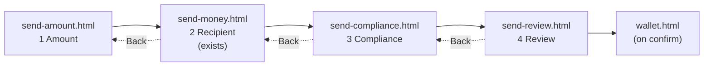
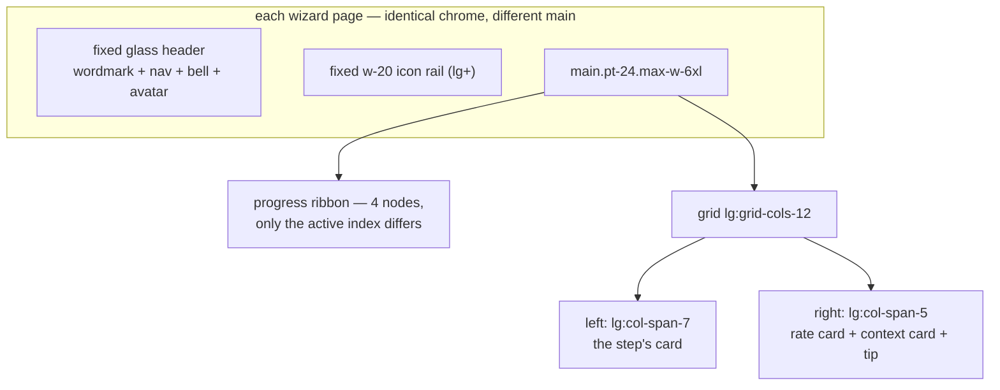

# Design — `send-money-wizard` (steps 1, 3, 4)

**Status:** agreed · **Owner:** Kirito (Claude) · **Tasks:** T021, T040–T042 ·
**Spec:** [SPEC.md](../../SPEC.md) US1, US2

> Completes the four-step flow whose progress ribbon has been promising four steps while only step 2
> existed. Authorised by the project leader on 2026-07-27 ("expand the UI along the line it is on
> now"), which is what unblocks T021 — see §2.

---

## 1. What this covers

The three send-money wizard steps that were never exported: **1 Amount**, **3 Compliance**,
**4 Review**. Step 2 (Recipient) already ships as `apps/web/send-money.html` and is unchanged.
It does not cover the Dashboard screen (T022) or Settings/Support.

## 2. Reference material — and the honest gap

**There is no PNG for these three screens.** That is a real difference from every other UI task in
this repo, and it is worth stating rather than glossing:

| Kind | Where |
| --- | --- |
| The design system | `legacy/stitch-mockups/ubuntu_heritage/DESIGN.md` — binding |
| **The de-facto reference** | `apps/web/send-money.html` (step 2) and `compliance.html` — the vocabulary these screens are composed from |
| Token ground truth | the `tailwind.config` block inlined in every page |
| Domain content | [domain-model.md](domain-model.md) §3 · [asco-orchestrator.md](asco-orchestrator.md) §4–5 |
| Conformance limits on copy | [iso20022-messaging.md](iso20022-messaging.md) §3.6 |

So the reference is **the built system**, not an image. That is a weaker constraint than a mockup,
and the mitigation is deliberate: these screens **invent no new component, no new colour, no new
spacing value and no new layout**. Every element is one that already exists on a shipping page, and
the page chrome (head, header, rail, grid, right column) is copied byte-for-byte from step 2 rather
than re-typed.

> **Verification gap, stated up front:** the session that built these could not see its own output.
> That is the same condition that produced the reverted React port ([frontend-web.md](frontend-web.md)
> §8). It is more tolerable here — this is new work composed from verified parts rather than a port
> with an exact target — but it is not eliminated. **These screens are unverified until a human opens
> them beside step 2.** Recorded in §9, and in STATUS.md's next actions.

## 3. Flow and structure

`send-money.html` keeps its filename despite being step 2 — renaming it would churn every existing
link and the frozen-export lineage for no user-visible gain. Noted so the naming doesn't read as an
oversight.

Every page has the identical three-part chrome:

**The right column persists across all four steps.** The exchange-rate card is the number the user
came for; removing it mid-flow would be a regression. Steps 3 and 4 swap the middle card of that
column for something step-appropriate, and keep the rate card and tip card in place.

## 4. Per-step content

### Step 1 — Amount (`send-amount.html`)

| Region | Content |
| --- | --- |
| Ribbon | node 1 active; 2–4 inactive |
| Left card | "How much are you sending?" — large amount field with ZAR affix, destination-corridor select (reusing step 2's globe-prefixed control), a "You send / They receive" conversion strip, four quick-amount chips |
| Actions | tertiary `Cancel` (left), primary `Continue to Recipient` (right) |
| Right | rate card · Ripple card · tip card, unchanged from step 2 |

Quick-amount chips are the one new *arrangement* — but the chip itself is the existing pill badge
shape (`rounded-full`, `surface-container-high`), not a new component.

### Step 3 — Compliance (`send-compliance.html`)

This is the screen where ASCO becomes visible, and the reason it is worth building: the whole
product claim is that a routing decision can be *explained*. It renders
[asco-orchestrator.md](asco-orchestrator.md) §4's negotiation as something a person can read.

| Region | Content |
| --- | --- |
| Ribbon | 1–2 complete (check); 3 active |
| Left card | "Compliance Verification" with three agent rows — **Compliance Sentinel** (verdict + risk score + cited rules), **Liquidity Strategist** (selected rail + cost + ETA), **Master Orchestrator** (state) — then a cited-rules block and the guardrail confirmation |
| Right | rate card · **negotiation log** (replaces the Ripple card) · tip card |

The agent rows use the same dot-and-two-lines pattern as the Ripple card's signal list. The
negotiation log is the compliance dashboard's validation-stream row, restated vertically.

**`citedRules` is rendered as a first-class element, never a tooltip.** An uncited verdict is
invalid by construction ([domain-model.md](domain-model.md) §3), so the UI that displays a verdict
displays its citations — the invariant is visible, not implied.

### Step 4 — Review (`send-review.html`)

| Region | Content |
| --- | --- |
| Ribbon | 1–3 complete; 4 active |
| Left card | "Review & Confirm" — recipient block, amount breakdown, the compliance declarations from step 2, the verdict summary from step 3, the selected rail with ETA, and the ISO 20022 message reference |
| Actions | tertiary `Back`, primary `Confirm & Send` (the only `lg` gradient button in the flow) |
| Right | rate card marked **locked** · settlement summary · tip card |

## 5. Copy constraints

New copy must respect the conformance boundary in
[iso20022-messaging.md](iso20022-messaging.md) §3.6. Specifically:

- ✅ "ISO 20022 message prepared", "pain.001 generated", "validated against the schema"
- ❌ "SARB compliant", "regulator approved", "conformant with SARB PEM"
- Static figures are the same declared-fixture situation as every other page (T025) — but nothing
  in the new copy asserts a live rate, a real verdict, or a completed settlement.

The legacy overclaiming copy on `compliance.html` / `wallet.html` is a separate, tracked conflict
([frontend-web.md](frontend-web.md) §10). **These pages do not add to it.**

## 6. Decisions & alternatives

| Decision | Chosen | Rejected, and why |
| --- | --- | --- |
| Chrome | copied byte-for-byte from step 2 by script | re-typing it — three chances to introduce a one-character divergence nobody would notice |
| Right column | persists on all four steps | step-specific columns — the rate is the reason the user is here |
| New components | **none** | designing new primitives for screens with no reference — that is how a system drifts, and there is no PNG to catch it |
| Step 3 content | the real ASCO negotiation, agent by agent | a generic spinner — the product claim is explicability, and a spinner explains nothing |
| Filenames | `send-amount` / `send-money` / `send-compliance` / `send-review` | renaming step 2 for consistency — churns every existing link for no user-visible gain |
| Entry point | `index.html` → `send-amount.html` | keeping the redirect at step 2 — the flow now has a real beginning |

## 7. Files

| Path | New? | Responsibility |
| --- | --- | --- |
| `apps/web/send-amount.html` | new | Step 1 |
| `apps/web/send-money.html` | unchanged | Step 2 — only its Back/Continue hrefs are wired |
| `apps/web/send-compliance.html` | new | Step 3 |
| `apps/web/send-review.html` | new | Step 4 |
| `apps/web/index.html` | changed | Redirect target moves to step 1 |

## 8. Contracts

When T025 lands, each step reads from the shapes in [domain-model.md](domain-model.md) §3 —
step 1 `FxQuote`/`TransferQuote`, step 3 `ComplianceVerdict` + `LiquidityProposal`
([asco-orchestrator.md](asco-orchestrator.md) §5), step 4 the whole `Transfer`. Until then the
figures are static and consistent across the four pages (15,000.00 ZAR → 111,300.00 KES at 7.42),
so the flow reads as one transaction rather than four unrelated screens.

## 9. How this is verified

- **Serve and walk the flow:** `python3 -m http.server 5173 --directory apps/web`, then step
  1 → 2 → 3 → 4 and back again. Chrome must not shift by a pixel between steps — the header, rail
  and grid are identical files.
- Ribbon state is correct on each page (completed nodes show a check, not a number).
- Every `href` resolves; Back/Continue are symmetric.
- **Open step 1, 3 and 4 beside step 2 and `compliance.html`** and confirm they read as the same
  product. This is the check that has NOT been done (§2).
- No new copy claims SARB conformance (§5).

## 10. Open questions

- [ ] These three screens are **unverified visually** (§2). First human pass supersedes this doc's
      "agreed" status if anything reads wrong.
- [ ] Step 3 currently shows a *settled* negotiation. The in-flight state — DESIGN.md's
      "Trust-Shield Overlay", a glassmorphic processing card — is designed in prose there but has no
      reference either. Worth building only once T025 makes the wait real.
- [ ] Step 1's quick-amount chips: are 500 / 1,000 / 5,000 / 15,000 ZAR the right rungs? Invented as
      plausible, not researched.
- [ ] `Cancel` on step 1 has nowhere to go — currently returns to `wallet.html`. Confirm that's the
      intended exit.
